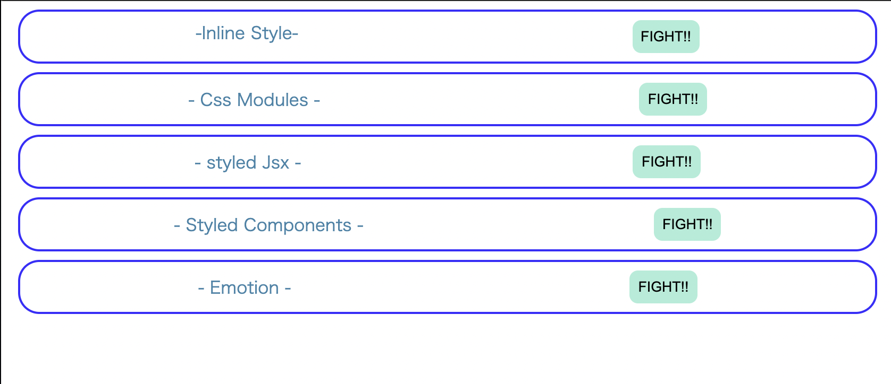

> sandbox-react-style-  
> react の style の当て方

> 毎回 import を忘れずに

＃ Inline Style -　インストール　　なし

```jsx
  const containerStyle = {
    <!-- cssを記入 -->
  };
  return (
    <div style={containerStyle}>
  );
```

＃ CssModules

- インストール　　なし
  > `comportnets` ディレクトリ下に`CssModules.module.scss`ファイルを作成する  
  > `CssModules.module.scss`に`css`以下を記入

```css
.container {
  /* cssを記入 */
}
```

> `CssModules.jsx`に以下を記入

```jsx
import classes from "./CssModules.module.scss"
 return (
    <div className={classes.container}>
  );
```
